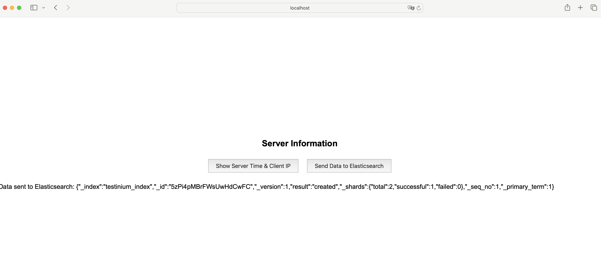

# devopstask

- internete kalapalı bir sunucuya tek node lu kubernetes kurulması. (gerekli olan paketler önceden internete açık bir ortamda hazrlanacak, hazırlanan paketler ve script ile birlikte internetsiz bir ortamda kubernetes clusterı kurulacak)
- ekte gönderilen java projesinin kubernetes ortamında çalıştırılması için gerekli olan Dockerfile ı yazılacak (proje java 21 ile yazılmıştır) 
- oluşturulan java image ı ve elastic/elasticsearch:8.16.2 image ı zip lenerek kubneretes kurulu makineye atılacak
- java uygulması ve elasticsearch uygulamasının çalışması için gerekli olan yaml hazırlanacak ve çalıştırılacak (java uygulaması aşağıdaki env ları almalıdır)
- uygulama çalıştırıldıktan sonra dashboarda ki uygulama butonlar ile index oluşturulabilir ve elasticsearche gönderilebilir, elasticsearch e gönderilen index aynı ortamda deploy edilen kibana aracılığı ile görüntülenecek.

- ELASTICSEARCH_USERNAME
- ELASTICSEARCH_PASSWORD
- ELASTICSEARCH_URL

